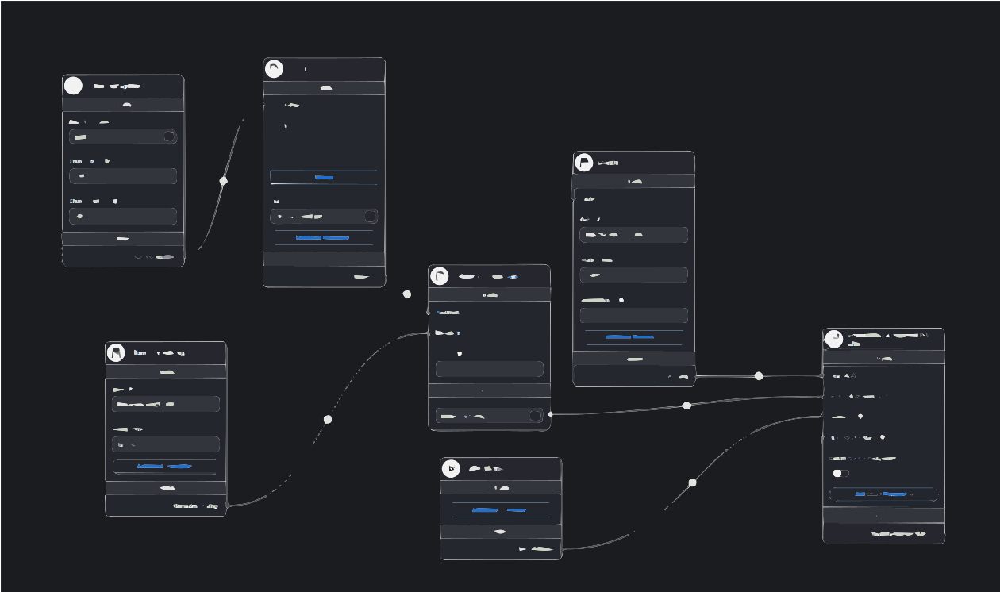

# 79ou9i: Smart Legal Assistance for Workers & Small Business Owners

Welcome to the **79ou9i** project! This app is designed to simplify legal and bureaucratic processes for *Tunisian workers* and *small business owners*. With advanced AI tools like Large Language Models (LLMs) and a Retrieval-Augmented Generation (RAG) system, 79ou9i provides essential support for navigating workplace rights, legal documents, and connecting with experts.

## Key Features

### 1. **Worker Rights Chatbot**
   - **Understand Labor Laws**: The chatbot helps workers in Tunisia understand their rights as per the *Tunisian Labor Code* (قانون الشغل التونسي) and other relevant frameworks, including the *Social Security Code* (القانون الأساسي للضمان الاجتماعي).
   - **Access to Legal Documents**: Workers can quickly access legal documents such as workplace safety laws (قانون الصحة والسلامة المهنية), anti-discrimination laws (قانون مناهضة التمييز), and collective employment agreements (اتفاقيات الشغل المشتركة).
   - **Legal Rulings Insights**: The chatbot offers legal guidance by analyzing *Cassation Court rulings* (أحكام محكمة التعقيب), helping users understand possible outcomes in labor disputes.
   

### 2. **Small Business Owner Support**
   - **Filling Legal Forms**: Assists small business owners with completing important legal documents such as company registration, tax forms, and employment contracts.
   - **Administrative Guidance**: Provides step-by-step support for tasks like registering employees for social security, filing tax returns, and managing government regulations.
   - **Automated Email Templates**: Offers pre-drafted email templates for business operations such as legal inquiries and compliance matters, saving valuable time on formal communications.
   - **Expert Recommendations**: Based on user needs, 79ou9i connects business owners with highly qualified *lawyers, accountants, and industry professionals*.

### 3. **Smart LLM Agent for Legal and Bureaucratic Assistance**
   - **Document Generation**: Automatically generates legal documents and forms required for legal or governmental submissions.
   - **Real-Time Recommendations**: The Smart LLM Agent provides legal and administrative solutions in real-time, tailored to the specifics of Tunisian laws and regulations.
   - **Connection to Experts**: Users are guided to trusted legal professionals, with a comprehensive database of lawyers and consultants ready to assist.

### 4. **Additional Features**
   - **User-Friendly Interface**: The app’s sleek design allows easy navigation, whether you’re a worker looking to resolve a legal query or a business owner dealing with administrative tasks.
   - **Secure Data Handling**: All user interactions, legal documents, and other sensitive data are securely stored and managed with modern encryption protocols.

## Technologies Used

- **Langchain**: Powers the RAG chatbot for seamless integration between LLMs and external data sources.
- **Hugging Face Transformers**: Implements LLMs capable of processing legal texts and generating user-friendly responses.
- **OpenAI API**: Provides natural language understanding and generation capabilities to ensure accuracy and relevance.
- **Gradio**: Builds an interactive interface for communicating with the AI chatbot.
- **MongoDB**: Stores user interactions, legal documents, and other relevant data, ensuring a reliable and scalable backend.

The **79ou9i** app was developed using a combination of modern web development tools and programming languages. The frontend was built with **HTML**, **CSS**, and **JavaScript** to create an intuitive and responsive user interface. For backend functionalities and AI integration, **Python** was used alongside frameworks like **Flask** and **Langchain**. The app also utilizes APIs like **OpenAI** and **Google Maps** to provide natural language processing and location-based services. Additionally, **MongoDB** was implemented to securely store user data and interactions.

## Installation

To get started with 79ou9i:

1. Clone the repository:
   ```bash
   git clone https://github.com/your-username/79ou9i.git
   cd 79ou9i
